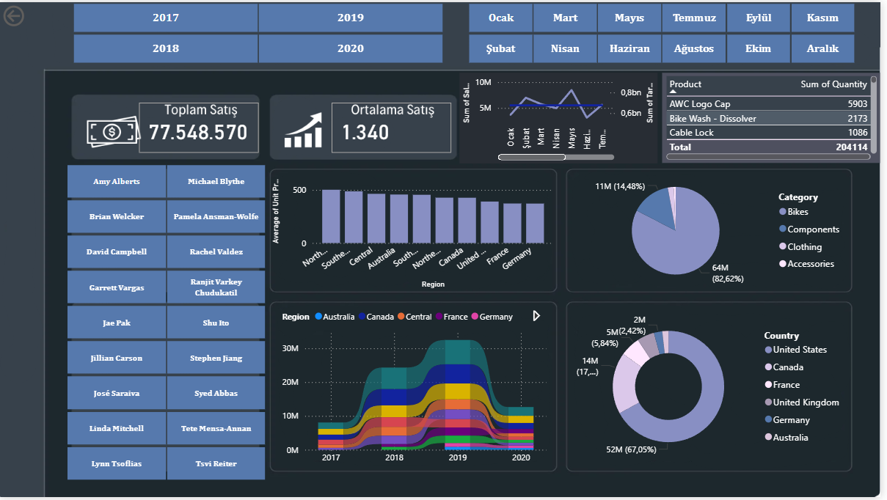

# AdventureWorks Sales Analysis 📊

Power BI ile gerçekleştirilen kapsamlı satış analizi projesi. 2017-2020 yılları arasındaki satış verilerini bölge, ürün kategorisi ve satış temsilcisi bazında görselleştirerek iş kararlarını destekleyecek içgörüler sunmaktadır.

## 🖼️ Dashboard Önizleme



## 📁 Proje İçeriği

| Dosya | Açıklama |
|---|---|
| `adventureSalesProje.pbix` | Power BI rapor dosyası |
| `Sales.xlsx` | Satış işlemleri verisi |
| `Product.xlsx` | Ürün bilgileri |
| `Region.xlsx` | Bölge bilgileri |
| `Reseller.xlsx` | Kurumsal müşteri bilgileri |
| `Salesperson.xlsx` | Satış temsilcisi bilgileri |
| `SalespersonRegion.xlsx` | Temsilci-bölge eşleştirmesi |
| `Targets.xlsx` | Satış hedefleri |

## 🔧 Kullanılan Teknolojiler

- **Power BI Desktop**
- **Microsoft Excel** (veri kaynağı)

## 📊 Dashboard İçeriği

- **Satış Performansı Genel Bakış** — Toplam ve ortalama satış metrikleri
- **Bölge Bazında Satış Dağılımı** — Yıl ve bölgeye göre şerit grafik
- **Ürün Kategorisi Analizi** — Kategori ve ürün bazında satış adetleri
- **Satış Temsilcisi Performansı** — 2017-2020 temsilci karşılaştırması
- **Bölgeye Göre Ortalama Fiyat** — Birim fiyat bölgesel değişimi

## 📈 Temel Bulgular

- **Toplam Satış:** 77.548.570 birim
- **Ortalama Satış Miktarı:** 1.340
- **Hedefe Ulaşma Oranı:** %82.62
- **En Çok Satan Kategori:** Bikes (%67.05)
- **En Yüksek Satış Bölgeleri:** United States, Canada
- **Zirve Yıllar:** 2018 ve 2019

## 🗂️ Veri Seti

Kaggle üzerinde yayınlanan [Adventure Works](https://www.kaggle.com/) veri seti kullanılmıştır. Microsoft tarafından oluşturulan bu veri seti; bisiklet üretimi ve satışı yapan kurgusal bir şirkete ait 2017-2020 yılları arasındaki işlem kayıtlarını içermektedir.

## 🚀 Nasıl Çalıştırılır

1. [Power BI Desktop](https://powerbi.microsoft.com/desktop/)'ı indirin ve kurun
2. Repo'yu klonlayın:
```bash
   git clone https://github.com/ranailhan/adventure-works-sales-analysis.git
```
3. `adventureSalesProje.pbix` dosyasını Power BI Desktop ile açın
4. Gerekirse veri kaynağı yollarını güncelleyin: **Transform Data > Data Source Settings**
